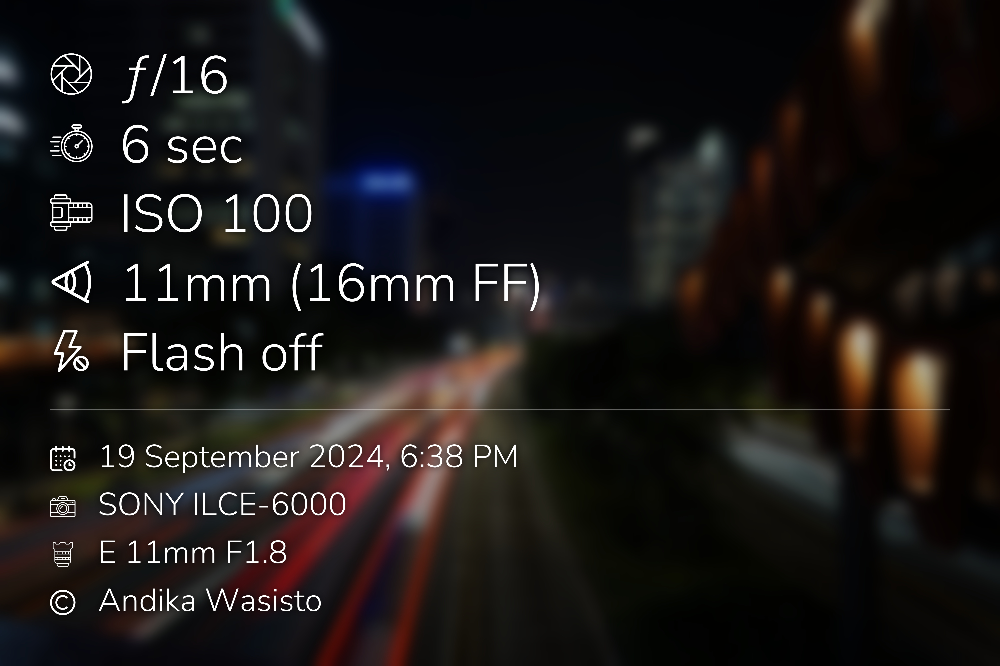

# exif_overlay

A script to add EXIF data overlay to image(s).

#### Sample input


#### Sample output



## Install dependencies

```bash
pip install -r requirements.txt
```

## Usage

#### Easy

```bash
./exif_overlay.py /home/user/Pictures/DSC01234.jpg
```

#### Advanced

```
usage: exif_overlay.py [-h] [--f-stop F_STOP] [--shutter-speed SHUTTER_SPEED] [--iso ISO]
                       [--focal-length FOCAL_LENGTH] [--flash FLASH] [--date-time DATE_TIME] [--camera CAMERA]
                       [--lens LENS] [--author AUTHOR] [--no-f-stop] [--no-shutter-speed] [--no-iso]
                       [--no-focal-length] [--no-flash] [--no-date-time] [--no-camera] [--no-lens] [--no-copyright]
                       input_images [input_images ...]

Add EXIF data overlay to image(s). Output images will be saved in the same directory as the input images with "_exif"
appended to the filename.

positional arguments:
  input_images          Path to the input image(s) (e.g., DSC01234.jpg or DSC*.jpg)

options:
  -h, --help            show this help message and exit
  --f-stop F_STOP       Override f-stop value (e.g., "f/2.8")
  --shutter-speed SHUTTER_SPEED
                        Override shutter speed (e.g., "60 sec")
  --iso ISO             Override ISO value (e.g., "ISO 100")
  --focal-length FOCAL_LENGTH
                        Override focal length (e.g., "50mm")
  --flash FLASH         Override flash status (e.g., "Flash auto, fired")
  --date-time DATE_TIME
                        Override date and time (e.g., "1 January 2006, 3:04 PM")
  --camera CAMERA       Override camera (e.g., "Sony a6000")
  --lens LENS           Override lens (e.g., "Pentax Super-Takumar 50mm f/1.4")
  --author AUTHOR       Override author name (e.g., "John Doe")
  --no-f-stop           Hide f-stop value
  --no-shutter-speed    Hide shutter speed
  --no-iso              Hide ISO value
  --no-focal-length     Hide focal length
  --no-flash            Hide flash status
  --no-date-time        Hide date and time
  --no-camera           Hide camera
  --no-lens             Hide lens
  --no-copyright        Hide copyright notice
```

## Attributions

[Aperture icon by flatart_icons](https://www.freepik.com/icon/lens_2346057)\
[Shutter speed icon by afif fudin](https://www.freepik.com/icon/stopwatch_17266331)\
[ISO icon by Abdul-Aziz](https://www.freepik.com/icon/film-roll_8900311)\
[Focal length icon by denis.klyuchnikov.1](https://www.freepik.com/icon/eye_16026371)\
[Flash icon by kornkun](https://www.freepik.com/icon/lightning_8396618)\
[Date and time icon by Freepik](https://www.freepik.com/icon/calendar_833593)\
[Camera icon by Freepik](https://www.freepik.com/icon/camera_883787)\
[Lens icon by Freepik](https://www.freepik.com/icon/lens_7291145)\
[Copyright icon by Freepik](https://www.freepik.com/icon/copyright_1294391)

## License

    MIT License
    
    Copyright (c) 2024 Andika Wasisto
    
    Permission is hereby granted, free of charge, to any person obtaining a copy
    of this software and associated documentation files (the "Software"), to deal
    in the Software without restriction, including without limitation the rights
    to use, copy, modify, merge, publish, distribute, sublicense, and/or sell
    copies of the Software, and to permit persons to whom the Software is
    furnished to do so, subject to the following conditions:
    
    The above copyright notice and this permission notice shall be included in all
    copies or substantial portions of the Software.
    
    THE SOFTWARE IS PROVIDED "AS IS", WITHOUT WARRANTY OF ANY KIND, EXPRESS OR
    IMPLIED, INCLUDING BUT NOT LIMITED TO THE WARRANTIES OF MERCHANTABILITY,
    FITNESS FOR A PARTICULAR PURPOSE AND NONINFRINGEMENT. IN NO EVENT SHALL THE
    AUTHORS OR COPYRIGHT HOLDERS BE LIABLE FOR ANY CLAIM, DAMAGES OR OTHER
    LIABILITY, WHETHER IN AN ACTION OF CONTRACT, TORT OR OTHERWISE, ARISING FROM,
    OUT OF OR IN CONNECTION WITH THE SOFTWARE OR THE USE OR OTHER DEALINGS IN THE
    SOFTWARE.